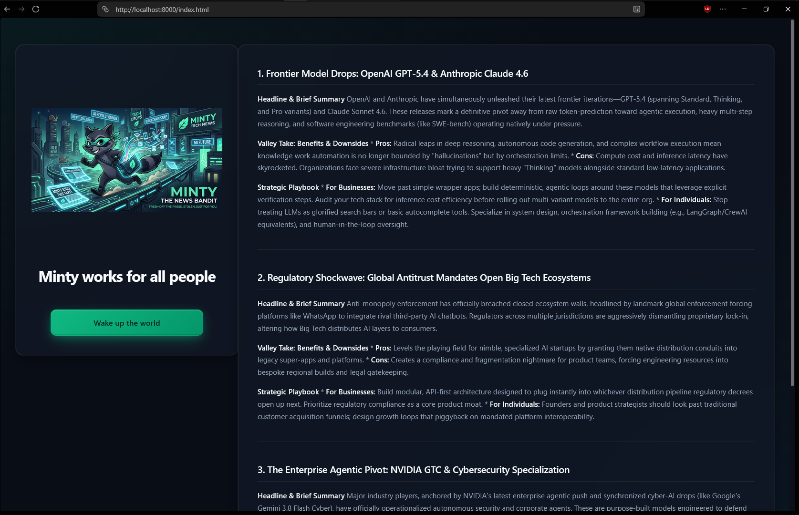

# Minty-search
**Minty** is a focused search engine designed to keep you effortlessly in touch with the fast-moving tech world. By combining privacy-focused meta-search crawling, AI reasoning, and a lightweight desktop interface, Minty helps you stay up to date with modern technology news, tools, and developments.




## Minty relies on the following core technologies to function:

* [**Eel**](https://github.com/python-eel/Eel?utm_source=gemini)**:** Python library for making simple Electron-like offline HTML/JS GUI apps.

* **Google Chatbot API / Gemini API:** Powering intelligent search queries, summaries, and tech insights.

* [**Firecrawl**](https://www.firecrawl.dev/?utm_source=gemini)**:** API that turns web content into clean Markdown to fuel accurate searches.

* [**SearXNG**](https://github.com/searxng/searxng?utm_source=gemini)**:** A free internet metasearch engine which aggregates results from various search services and databases.

## Installation

Follow these steps to set up Minty on your local machine.

### Prerequisites

Before installing Minty, ensure you have the following installed and configured:

1. **Python 3.8+**: Download and install Python from [python.org](https://www.python.org/?utm_source=gemini).

2. **Google Chrome**: Eel uses Chrome (or a Chromium-based browser) in `--app` mode for rendering the desktop UI.

3. **SearXNG Instance**: An active, accessible SearXNG instance (local Docker instance or public instance endpoint URL).

4. **API Keys**:

   * **Google AI Studio Key**: A key for the Google Gemini/Chatbot API.

   * **Firecrawl API Key**: An API key from Firecrawl for web scraping capabilities.

### Setup Instructions

1. **Clone or download the repository:**

   ```
   git clone https://github.com/your-username/minty.git
   cd minty
   
   ```

2. **Set up a virtual environment (Optional but recommended):**

   ```
   python -m venv venv
   # On Windows:
   venv\Scripts\activate
   # On macOS/Linux:
   source venv/bin/activate
   
   ```

3. **Install required dependencies:**

   ```
   pip install eel google-generativeai firecrawl-py requests
   
   ```

4. **Configure your environment variables / API keys:**
   Create a `.env` file or update your configuration file with your credentials:

   ```
   GOOGLE_API_KEY=your_google_api_key_here
   FIRECRAWL_API_KEY=your_firecrawl_api_key_here
   SEARXNG_URL=http://localhost:8080 # or your SearXNG instance URL
   
   ```

5. **Run Minty:**

   ```
   python main.py
   
   ```

##  Attribution & Credits

* **Application Logic & Core Code:** Created and maintained by the author.

* **Stylesheet / CSS:** The CSS for Minty was generated/assisted by AI models and experimental design tweaks. I **do not claim ownership** of the stylesheet file itself. All credit for styling frameworks or foundational aesthetic references belongs to their respective creators/tools.

##  Troubleshooting & Support

* **Browser fails to launch:** Make sure Google Chrome or a Chromium-based browser is installed on your system path so Eel can attach to it.

* **SearXNG connection error:** Verify that your SearXNG instance is running and reachable at the specified URL, and that JSON output is enabled on your instance settings if required.

* **Search fails or times out:** Verify that both your Google API key and Firecrawl API key are valid and have active usage limits.
